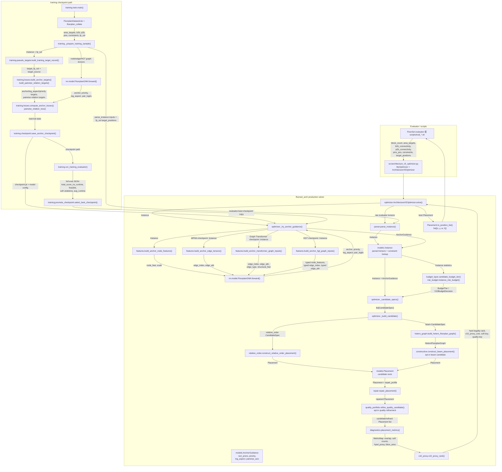

# Data-Driven SoC Floorplanning

本專案是 ICCAD 2026 FloorSet Challenge Problem C 的 SoC floorplanning solver。當前 evaluator-facing 主線是 `Architecture v5` wrapper：用 Anchor-GNN checkpoint 產生 block-level 幾何先驗，再由 `floorset_arch` 的 relative-order / hetero-graph constructive decoder 生成合法 placement，最後用 repair pass 修正 overlap、boundary、grouping 與 MIB 等限制。

目前 production 預設 checkpoint：

```bash
checkpoints/gnn_transformer_best_0521_ns1000000_ep3_encgraph_transformer_h256_l6_acc32_heads8.pt
```

若要覆蓋模型，可以設定 `.env` 或環境變數：

```bash
FLOORSET_GNN_CHECKPOINT=checkpoints/your_checkpoint.pt
```

## Problem 定義

FloorSet Problem C 要求對一組 SoC blocks 產生 2D floorplan。每個 block 必須輸出 `(x, y, w, h)`，其中 `(x, y)` 是左下角座標，`w/h` 是寬高。

輸入包含：

- `block_count`：有效 block 數量。
- `area_targets`：每個 soft block 的目標面積。
- `b2b_connectivity`：block-to-block 加權連線，用於 HPWL。
- `p2b_connectivity` 與 `pins_pos`：block-to-terminal 加權連線與 terminal 座標。
- `constraints`：固定形狀、預放置、MIB、grouping、boundary 等限制。
- `target_positions`：訓練資料或 evaluator 提供的參考位置，對 fixed/preplaced block 特別重要。

硬限制：

- 所有 blocks 不可重疊。
- soft block 面積誤差必須在 1% 以內。
- fixed-shape block 必須保留指定尺寸。
- preplaced block 必須保留指定位置與尺寸。
- 違反硬限制的 case 會被視為 infeasible，單 case cost 會被固定懲罰為 `M = 10`。

軟限制：

- `Boundary`：指定 block 應貼齊 bounding box 的邊或角。
- `Grouping`：同 group blocks 應透過邊相鄰形成連通 component。
- `MIB`：同 MIB group blocks 應有一致的 width/height。
- 軟限制違反不會讓解 infeasible，但會進入指數懲罰項。

目標函數核心是同時降低 HPWL gap、bounding-box area gap、soft violation ratio 與 runtime factor。分數越低越好，100 個 validation/test cases 會按 block count 指數加權，所以大型 case 的失敗會主導 total score。

## Total Score No Runtime

`total_score_no_runtime` 是本 repo 目前做 solver 架構、repair policy、candidate matrix 與 checkpoint promotion 的主要本地指標。它沿用官方 evaluator 的 quality 與 soft-violation 計算，但把 runtime adjustment 固定為 `1.0`：

```text
cost_no_runtime = quality_factor * violation_factor
```

用途：

- 比較 solver 架構、repair policy、candidate matrix 與 checkpoint 時，先排除本地 runtime median 的扭曲。
- 提交前仍要看 raw runtime、P90 runtime、max runtime 與 runtime-aware `total_score`，但它們是 gating / sanity check，不取代 full-validation no-runtime promotion。
- checkpoint promotion 以 full validation 的 `total_score_no_runtime` 為準，不只看 supervised validation loss。

相關文件：

- `CONTEXT.md`：定義 No-Runtime Quality Score、Local Runtime-Aware Score、Production Solver Path 等專案語言。
- `docs/optimization-notes.md`：記錄目前調參政策與不要重複嘗試的 ablation。
- `docs/evaluation/2026-05-11-no-runtime-promotion.md`：記錄 no-runtime checkpoint promotion 與 large-case matrix evidence。

## Clone 與安裝

第一次 clone repo 時要把 submodule 一起拉下來，否則 `FloorSet/` 會是 empty 或缺少官方 evaluator / dataset files。

```bash
git clone --recursive <repo-url>
cd Data-Driven-SoC-Floorplanning
```

如果已經 clone 過但 `FloorSet/` 是空的，或忘記加 `--recursive`：

```bash
git submodule update --init --recursive
```

```bash
bash scripts/install.sh
```

這會初始化 `FloorSet` submodule、安裝 `uv`、建立 venv、安裝 dependencies，並用官方 template 跑一個 quick evaluator smoke test。

## Scripts 目的與使用方法

### `scripts/iccad2026_evaluate.py`

這是本 repo 保存的 no-runtime 版本 evaluator。因為 `FloorSet/` 是官方 repo/submodule，這個專案無法直接把修改後的 `iccad2026_evaluate.py` push 回官方 repo，所以第一次 clone 或每次重置 submodule 後，請手動 copy 這個版本去取代官方 submodule 裡的 evaluator：

```bash
cp scripts/iccad2026_evaluate.py FloorSet/iccad2026contest/iccad2026_evaluate.py
```

取代後，`scripts/eval_total.sh` 才會穩定輸出：

```text
Total Score (No Runtime)
Avg Cost (No Runtime)
```

如果之後執行 `git submodule update --init --recursive`、切換 `FloorSet` 版本，或 submodule 被 reset，請重新執行一次 copy 指令。

### `scripts/eval_single.sh`

跑單一 validation/test case，預設 `test_id=95`。會讀取 `.env`，若未設定 `FLOORSET_GNN_CHECKPOINT`，會使用目前 production 預設 checkpoint。

```bash
bash scripts/eval_single.sh
bash scripts/eval_single.sh 99
```

### `scripts/eval_total.sh`

跑完整 100-case evaluator，並輸出 `Total Score`、`Total Score (No Runtime)`、平均 runtime、median runtime、P90 runtime 等指標。

```bash
bash scripts/eval_total.sh
bash scripts/eval_total.sh gnn_transformer_best_0521_ns1000000_ep3_encgraph_transformer_h256_l6_acc32_heads8.pt
bash scripts/eval_total.sh checkpoints/gnn_transformer_best_0521_ns1000000_ep3_encgraph_transformer_h256_l6_acc32_heads8.pt
bash scripts/eval_total.sh /abs/path/to/checkpoint.pt
```

checkpoint 解析規則：

- 無參數：優先用 `.env` 的 `FLOORSET_GNN_CHECKPOINT`，否則用既有 shell 環境變數，再否則用 production 預設 checkpoint。
- 傳入 checkpoint 參數時：該參數優先於 `.env` 與既有 shell 環境變數。
- 只有檔名：視為 `checkpoints/<name>`。
- repo-relative path：視為 repo root 下的相對路徑。
- absolute path：直接使用。

Evaluator / submission sanity controls：

```bash
FLOORSET_EVAL_REFRESH=1 bash scripts/eval_total.sh --best-since-0512
FLOORSET_REPAIR_TRACE_JSONL=artifacts/repair_trace.jsonl bash scripts/eval_single.sh 99
```

Solver ablation-only controls：

```bash
FLOORSET_ENABLE_V10_SOFT_REPAIR=1 FLOORSET_ENABLE_CONDITIONAL_RUNTIME_BUDGET=1 bash scripts/eval_total.sh
FLOORSET_ENABLE_NARROW_GROUPING_PAIR_BIAS=0 bash scripts/eval_total.sh
FLOORSET_ENABLE_QUALITY_PORTFOLIO=auto bash scripts/eval_total.sh
```

已移除的 hard runtime-tail clamp 與 broad grouping-adjacency flag 只保留在歷史 evidence 文件，不再作為 README runnable instruction。

### `scripts/validate.sh`

執行官方 submission interface validate，不跑完整 scoring：

```bash
bash scripts/validate.sh
```

### `scripts/train.sh`

訓練 Anchor-GNN checkpoint。預設參數與目前 v4 方向一致：`hidden_dim=192`、`layers=6`、`num_samples=800000`、`epochs=4`、`lr=3e-4`、`val_samples=10000`、pairwise head 開啟，並使用 weighted dirty-sample training。

```bash
bash scripts/train.sh
```

常用 override：

```bash
NUM_SAMPLES=200000 EPOCHS=10 LR=4e-4 bash scripts/train.sh
OUTPUT_DIR=checkpoints CHECKPOINT_TAG=remote_run bash scripts/train.sh
WANDB_MODE=offline WANDB=0 bash scripts/train.sh
RESUME_CHECKPOINT=checkpoints/old.pt bash scripts/train.sh
```

重要訓練政策：

- `CLEAN_SAMPLE_POLICY=weighted` 是預設值，因為目前 clean-only sample ratio 太低。
- dirty samples 仍可提供低權重 geometry reference。
- dirty order/pairwise supervision 預設被抑制，避免把 soft-violating `fp_sol` 當成可靠 constraint oracle。
- `WRITE_STABLE_CHECKPOINTS=1` 才會覆寫穩定檔名，例如 `gnn_best.pt`。

### `scripts/train_transformer.sh`

訓練 Graph Transformer encoder 版本的 Anchor-GNN。參數格式與 `scripts/train.sh` 相同，但預設 `ENCODER=graph-transformer`、`NUM_HEADS=8`、`CHECKPOINT_PREFIX=gnn_transformer`，log 檔名也會帶 `train_arch_v5_transformer`。

```bash
bash scripts/train_transformer.sh
DEVICE=cpu WANDB=0 NUM_SAMPLES=2 VAL_SAMPLES=1 EPOCHS=1 HIDDEN_DIM=16 LAYERS=1 bash scripts/train_transformer.sh
OUTPUT_DIR=checkpoints CHECKPOINT_TAG=remote_transformer_run bash scripts/train_transformer.sh
RESUME_CHECKPOINT=checkpoints/old_transformer.pt bash scripts/train_transformer.sh
```

### `scripts/train_hgt.sh`

訓練 Local HGT encoder 版本的 Anchor-GNN。HGT 會保留 block、pin、cluster、MIB 與 boundary typed nodes，並只沿 heterogeneous factor graph 的 typed local edges 做 relation-specific attention；v1 不加入 global attention/refinement layer。參數格式與 `scripts/train_transformer.sh` 相同，但預設 `ENCODER=hgt`、`NUM_HEADS=4`、`BATCH_SIZE=8`、`CHECKPOINT_PREFIX=gnn_hgt`，log 檔名會帶 `train_arch_v5_hgt`。目前 quality-first HGT retraining 預設為 `NUM_SAMPLES=800000`、`EPOCHS=6`、`LR=1.5e-4`、`ASPECT_WEIGHT=0.06`、repaired pseudo targets 開啟、`HGT_RELATION_GATE_MIN=0.20`，並用 `HIGH_RISK_ORDER_MULTIPLIER=1.8` / `HIGH_RISK_PAIRWISE_MULTIPLIER=1.6` 加強高風險樣本的 order/pairwise 訓練 loss；這些 training weights 不直接改 decoder/repair。

```bash
bash scripts/train_hgt.sh
DEVICE=cpu WANDB=0 NUM_SAMPLES=2 VAL_SAMPLES=1 EPOCHS=1 HIDDEN_DIM=16 LAYERS=1 bash scripts/train_hgt.sh
BATCH_SIZE=4 bash scripts/train_hgt.sh
OUTPUT_DIR=checkpoints CHECKPOINT_TAG=remote_hgt_run bash scripts/train_hgt.sh
RESUME_CHECKPOINT=checkpoints/old_hgt.pt bash scripts/train_hgt.sh
```

HGT dirty-sample experiments can tune repaired pseudo targets:

```bash
ENABLE_REPAIRED_PSEUDO_TARGETS=1 bash scripts/train_hgt.sh
DIRTY_PSEUDO_ORDER_WEIGHT=0.20 DIRTY_PSEUDO_CLEAN_ENOUGH_ORDER_WEIGHT=0.35 ENABLE_REPAIRED_PSEUDO_TARGETS=1 bash scripts/train_hgt.sh
```

Training / checkpoint controls：

```bash
CHECKPOINT_METRICS_MANIFEST=artifacts/checkpoint_metrics.jsonl \
EVALUATOR_BEST_CHECKPOINT=checkpoints/gnn_hgt_best_evaluator.pt \
bash scripts/train_hgt.sh
```

`TRAIN_EVALUATE_EACH_EPOCH=1` 是 `scripts/train_hgt.sh` 目前預設，會在每個 epoch 後用 production-default checkpoint-isolation env 跑 full evaluator，把 evaluator evidence append 到 manifest，並只依 evaluator evidence 更新 evaluator-best checkpoint。若只想做 training-health run，可以設定 `TRAIN_EVALUATE_EACH_EPOCH=0`。

Guidance ablations are evaluator-time knobs:

```bash
FLOORSET_GUIDANCE_ANCHOR_ONLY=1 bash scripts/eval_total.sh checkpoints/model.pt
FLOORSET_GUIDANCE_DISABLE_PAIRWISE=1 bash scripts/eval_total.sh checkpoints/model.pt
```

### `scripts/update.sh`

自動 `fetch/pull/status/add/commit/push`，預設推到 `origin arch-v4`。適合個人工作流，但在 reviewer 會檢查輸出時建議先手動看 diff。

```bash
bash scripts/update.sh "update: message"
```

## `src/` 模組架構

```text
src/
├── architecture_v5_optimizer.py
└── floorset_arch/
    ├── __init__.py
    ├── budget_layer.py
    ├── constructive.py
    ├── diagnostics.py
    ├── features.py
    ├── geometry.py
    ├── hetero_graph.py
    ├── models.py
    ├── optimizer.py
    ├── parser.py
    ├── quality_portfolio.py
    ├── relative_order.py
    ├── repair.py
    ├── risk_budget.py
    ├── scoring.py
    ├── surrogate_guidance.py
    ├── v10_proxy.py
    ├── nn/
    │   ├── __init__.py
    │   └── model.py
    └── training/
        ├── __init__.py
        ├── checkpoint.py
        ├── losses.py
        ├── promote_checkpoint.py
        ├── pseudo_targets.py
        ├── selection.py
        └── train.py
```

### 完整架構資料流圖

下面這張圖描述目前 `Architecture v5` 的 production inference path、training checkpoint path，以及兩者共用的模型 output contract。箭頭上的文字是「前一個 module/class/function 實際傳給下一個 module/class/function 的主要物件」。



純文字版本如下，適合在不支援 Mermaid 的 terminal / review tool 中閱讀：

```text
Architecture v5 Production Data Flow
===================================================

   Evaluator input tensors
   +---------------------------------------------------------------+
   | block_count, area_targets, b2b_connectivity, p2b_connectivity |
   | pins_pos, constraints, target_positions                       |
   +-------------------------------+-------------------------------+
                                   |
                                   | parser.parse_instance()
                                   v
   +---------------------------------------------------------------+
   | models.Instance                                                |
   | - valid_b2b / valid_p2b                                        |
   | - fixed / preplaced / MIB / grouping / boundary lookup         |
   | - b2b_by_block / p2b_by_block                                  |
   +-------------------------------+-------------------------------+
                                   |
                                   | optimizer._try_anchor_guidance()
                                   v
   +--------------------------- Anchor-GNN guidance ---------------------------+
   | checkpoint.pt                                                              |
   |       |                                                                    |
   |       +--> MPNN / legacy GNN                                                |
   |       |    build_anchor_node_features() + build_anchor_edge_tensors()       |
   |       |                                                                    |
   |       +--> Graph Transformer                                                |
   |       |    build_anchor_transformer_graph_inputs()                          |
   |       |    block graph + factor-derived context edges + structural features  |
   |       |                                                                    |
   |       +--> Local HGT                                                        |
   |            build_anchor_hgt_graph_inputs()                                  |
   |            typed block / pin / cluster / MIB / boundary relations           |
   |                                                                            |
   | all encoder paths                                                           |
   |       |                                                                    |
   |       v                                                                    |
   | nn.model.FloorplanGNN.forward()                                             |
   |       |                                                                    |
   |       v                                                                    |
   | shared heads: anchor, priority, log_aspect, pair_logits                     |
   +-------------------------------+--------------------------------------------+
                                   |
                                   | _anchor_predictions_to_guidance()
                                   v
   +---------------------------------------------------------------+
   | models.AnchorGuidance                                         |
   | rect_priors, priority, log_aspect, pairwise_axis              |
   +-------------------------------+-------------------------------+
                                   |
                                   | Instance.anchor_guidance
                                   v
   +---------------- Candidate generation and repair ----------------+
   | optimizer._candidate_specs()                                  |
   |   input : Instance statistics + budget_layer / risk_budget     |
   |   output: list[CandidateSpec]                                  |
   |                                                               |
   | optimizer._build_candidate()                                  |
   |   +--> relative_order.construct_relative_order_placement()     |
   |   |    input : Instance + AnchorGuidance + profile             |
   |   |    output: Placement                                      |
   |   |                                                          |
   |   +--> constructive.construct_beam_placement() [opt-in]        |
   |        input : Instance + HeteroFloorplanGraph                 |
   |        output: Placement                                      |
   |                                                               |
   | repair.repair_placement()                                     |
   |   input : Placement + repair_profile                          |
   |   output: repaired Placement                                  |
   |                                                               |
   | quality_portfolio.refine_quality_candidate() [opt-in]          |
   |   input : repaired Placement + quality_profile                 |
   |   output: refined Placement                                   |
   +-------------------------------+-------------------------------+
                                   |
                                   | diagnostics.placement_metrics()
                                   v
   +---------------------------------------------------------------+
   | MetricMap                                                     |
   | overlap_count, boundary/grouping/MIB violations,              |
   | hpwl_proxy, bbox_area                                         |
   +-------------------------------+-------------------------------+
                                   |
                                   | v10_proxy.v10_proxy_rank()
                                   v
   +---------------------------------------------------------------+
   | Candidate rank                                                |
   | hard-legality rank -> v10 no-runtime proxy -> soft key        |
   +-------------------------------+-------------------------------+
                                   |
                                   | optimizer._select_best_candidate()
                                   v
   +---------------------------------------------------------------+
   | best Placement                                                |
   | Placement.to_position_list(block_count)                       |
   +-------------------------------+-------------------------------+
                                   |
                                   v
                         list[(x, y, w, h)] to evaluator


Training-to-checkpoint loop
===================================================

   FloorplanDatasetLite + fp_sol
          |
          v
   training._prepare_training_sample()
          |
          +--> parse_instance() ---------------------> Instance
          |
          +--> pseudo_targets.build_training_target_record()
          |       output: clean / dirty / repaired target_fp_sol
          |
          +--> features.* graph builders
                  output: MPNN, Graph Transformer, or HGT tensors
          |
          v
   FloorplanGNN.forward()
          |
          v
   shared heads: anchor, priority, log_aspect, pair_logits
          |
          v
   losses.compute_anchor_losses() + pairwise_relation_loss()
          |
          v
   checkpoint.save_anchor_checkpoint()
          |
          +--> production _try_anchor_guidance()
          |
          +--> training.run_training_evaluator()
                   output: full eval JSON / metric manifest
                         |
                         v
              promote_checkpoint.select_best_checkpoint()
                   selection: total_score_no_runtime first
```

#### Module / class / function I/O contract

| Layer                             | Module / class / function                                                                               | Input                                                                                                                              | Output                                                                                                           | 傳給                                                                |
| --------------------------------- | ------------------------------------------------------------------------------------------------------- | ---------------------------------------------------------------------------------------------------------------------------------- | ---------------------------------------------------------------------------------------------------------------- | ------------------------------------------------------------------- |
| contest wrapper                   | `src/architecture_v5_optimizer.py`                                                                    | 官方 evaluator import path                                                                                                         | `MyOptimizer` / `ContestOptimizer` alias                                                                     | `ArchitectureV5Optimizer.solve()`                                 |
| solver entry                      | `optimizer.ArchitectureV5Optimizer.solve()`                                                           | `block_count`、`area_targets`、`b2b_connectivity`、`p2b_connectivity`、`pins_pos`、`constraints`、`target_positions` | `list[(x, y, w, h)]`                                                                                           | FloorSet evaluator                                                  |
| parser                            | `parser.parse_instance()`                                                                             | evaluator tensors                                                                                                                  | `models.Instance`                                                                                              | guidance、candidate spec、decoder、repair、scoring                  |
| shared data model                 | `models.Instance`                                                                                     | parsed tensors + fixed/preplaced/MIB/grouping/boundary lookup                                                                      | `Instance` with `valid_b2b`、`valid_p2b`、`b2b_by_block`、`p2b_by_block`、optional `anchor_guidance` | 幾乎所有 solver modules                                             |
| checkpoint guidance               | `optimizer._try_anchor_guidance()`                                                                    | `Instance` + `FLOORSET_GNN_CHECKPOINT` / default checkpoint                                                                    | `models.AnchorGuidance` 或 `None`                                                                            | `Instance.anchor_guidance`、relative-order decoder                |
| feature builder                   | `features.build_anchor_node_features()`                                                               | `Instance`                                                                                                                       | `node_feat`、`scale`                                                                                         | `FloorplanGNN.forward()`、hetero graph builders、training targets |
| MPNN feature builder              | `features.build_anchor_edge_tensors()`                                                                | `Instance`                                                                                                                       | `edge_index`、`edge_attr`                                                                                    | MPNN checkpoint 的 `FloorplanGNN.forward()`                       |
| Graph Transformer feature builder | `features.build_anchor_transformer_graph_inputs()`                                                    | `Instance`                                                                                                                       | `edge_index`、`edge_attr`、`edge_type`、`node_structural_features`                                       | Graph Transformer checkpoint 的 `FloorplanGNN.forward()`          |
| HGT feature builder               | `features.build_anchor_hgt_graph_inputs()`                                                            | `Instance`                                                                                                                       | typed `node_features`、typed `edge_index`、typed `edge_attr`、`relation_specs`                           | HGT checkpoint 的 `FloorplanGNN.forward()`、HGT training batch    |
| neural model                      | `nn.model.FloorplanGNN`                                                                               | block features + encoder-specific graph tensors + optional `pairs`                                                               | shared heads:`anchor`、`priority`、`log_aspect`、optional `pair_logits`                                  | `_anchor_predictions_to_guidance()`、training losses              |
| guidance adapter                  | `optimizer._anchor_predictions_to_guidance()`                                                         | model predictions +`scale` + optional `pairs`                                                                                  | `AnchorGuidance.rect_priors`、`priority`、`log_aspect`、`pairwise_axis`                                  | `construct_relative_order_placement()`                            |
| candidate planner                 | `optimizer._candidate_specs()`                                                                        | `Instance` statistics + env flags                                                                                                | `list[CandidateSpec]`                                                                                          | `_build_candidates()` / `_build_candidate()`                    |
| budget decision                   | `budget_layer.candidate_budget_tier()` / `quality_portfolio_allowed()` / `budget_trace_context()` | `Instance` + `risk_budget.instance_risk_budget()`                                                                              | `BudgetTier`、quality portfolio gate、trace dict                                                               | candidate matrix、quality portfolio、repair trace                   |
| main decoder                      | `relative_order.construct_relative_order_placement()`                                                 | `Instance`、`SolverConfig`、profile、`AnchorGuidance`                                                                        | initial `Placement`                                                                                            | `repair.repair_placement()`                                       |
| opt-in beam graph                 | `hetero_graph.build_hetero_floorplan_graph()`                                                         | `Instance` + optional block features                                                                                             | `HeteroFloorplanGraph` with block/pin/cluster/MIB/boundary nodes and typed edges                               | `constructive.construct_beam_placement()`、feature builders       |
| opt-in beam decoder               | `constructive.construct_beam_placement()`                                                             | `Instance`、`SolverConfig`、`HeteroFloorplanGraph`                                                                           | initial `Placement`                                                                                            | `repair.repair_placement()`                                       |
| repair                            | `repair.repair_placement()`                                                                           | `Instance`、candidate `Placement`、`SolverConfig` / repair profile                                                           | repaired `Placement` + optional `runtime_budget_trace`                                                       | quality refinement、diagnostics、candidate ranking                  |
| quality refinement                | `quality_portfolio.refine_quality_candidate()`                                                        | `Instance`、`Placement`、`SolverConfig`、quality profile                                                                     | refined `Placement`                                                                                            | candidate list / ranking                                            |
| diagnostics                       | `diagnostics.placement_metrics()`                                                                     | `Instance` + `Placement`                                                                                                       | `MetricMap`: overlap count, boundary/grouping/MIB violations, HPWL proxy, bbox area                            | `v10_proxy_rank()`、trace JSONL                                   |
| candidate rank                    | `v10_proxy.v10_proxy_rank()`                                                                          | `Instance`、`Placement`、metrics                                                                                               | hard-legality rank + no-runtime proxy + soft/quality keys                                                        | `_select_best_candidate()`                                        |
| final adapter                     | `Placement.to_position_list()`                                                                        | best `Placement` + `block_count`                                                                                               | evaluator-required `(x, y, w, h)` rows                                                                         | FloorSet evaluator                                                  |
| training sample prep              | `training._prepare_training_sample()`                                                                 | dataset tensors +`fp_sol`                                                                                                        | parsed `Instance`、graph tensors、targets、weights、pairs                                                      | `run_epoch()`                                                     |
| pseudo targets                    | `training.pseudo_targets.build_training_target_record()`                                              | `Instance` + `fp_sol` + pseudo-target config                                                                                   | clean/dirty/repaired `target_fp_sol` + source metadata                                                         | training target builders                                            |
| training losses                   | `training.losses.compute_anchor_losses()` / `pairwise_relation_loss()`                              | shared model heads + target tensors + weights                                                                                      | loss parts、pair accuracy                                                                                        | optimizer step、train/val stats                                     |
| checkpoint save/load              | `training.checkpoint.save_anchor_checkpoint()` / `load_checkpoint()`                                | model state + model config + train/val stats                                                                                       | checkpoint payload                                                                                               | `_try_anchor_guidance()`、resume training、training evaluator     |
| evaluator promotion               | `training.run_training_evaluator()` / `promote_checkpoint.select_best_checkpoint()`                 | checkpoint + full evaluator JSON / metric manifest                                                                                 | evaluator-best checkpoint by `total_score_no_runtime` first                                                    | production checkpoint candidate                                     |

#### 共用 output contract

- `FloorplanGNN` 的 encoder 可以是 `mpnn`、`graph-transformer` 或 `hgt`，但輸出 head contract 固定為 `anchor`、`priority`、`log_aspect`、`pair_logits`。
- inference 端把這些 shared heads 轉成 `AnchorGuidance`：`anchor` 變成 `rect_priors`，`priority` 影響 ordering signal，`log_aspect` 影響 soft block shape，`pair_logits` 變成 `pairwise_axis`。
- training 端用同一組 shared heads 對齊 `fp_sol` / repaired pseudo target：`anchor`、`log_aspect`、`priority` 進 `compute_anchor_losses()`，`pair_logits` 進 `pairwise_relation_loss()`。
- decoder / repair / scoring 共用 `Instance` 和 `Placement`：decoder 產生 `Placement`，repair 只修改 `Placement.rects`，diagnostics/scoring/v10 proxy 都用同一份 `Placement` 計算 rank。
- `total_score_no_runtime` 不在 `solve()` 裡直接計算；它由 evaluator JSON 回流到 training checkpoint promotion，作為 checkpoint 與架構 promotion 的主要 full-validation 指標。

### Active production path

`src/architecture_v5_optimizer.py` 是目前 evaluator scripts 使用的 contest-facing wrapper。它把 repo root、`src/` 和 `FloorSet/iccad2026contest` 加到 `sys.path`，並把 `MyOptimizer` / `ContestOptimizer` 指向 `floorset_arch.optimizer.ArchitectureV5Optimizer`。

`floorset_arch.optimizer.ArchitectureV4Optimizer` 目前保留為 `ArchitectureV5Optimizer` 的相容 alias，供舊 tests 或歷史 docs 讀懂演進脈絡；新的 eval/validate script 一律使用 v5 wrapper。

`src/floorset_arch/optimizer.py` 是 production solver 入口。`solve()` 的流程是：

1. `parser.parse_instance()` 把 evaluator tensors 轉成 `Instance`。
2. `_try_anchor_guidance()` 載入 `FLOORSET_GNN_CHECKPOINT` 或預設 checkpoint，產生 `AnchorGuidance`。
3. `_candidate_specs()` 依 instance statistics 選 candidate profiles。
4. candidate 由 `relative_order.construct_relative_order_placement()` 或 opt-in `constructive.construct_beam_placement()` 生成。
5. `repair.repair_placement()` 修正 overlap、boundary、grouping、MIB。
6. `_select_best_candidate()` 使用 hard legality gate 和 V10 no-runtime proxy 選出 best placement。
7. 回傳 evaluator 要求的 `(x, y, w, h)` list。

GNN / Graph Transformer / HGT 的 guidance 都只改 `AnchorGuidance` 的來源，不改 production decoder / repair / ranking contract：

- MPNN / legacy GNN checkpoint：`_try_anchor_guidance()` 使用 `build_anchor_node_features()` 和 `build_anchor_edge_tensors()`，主要從 block feature 與 b2b weighted edges 產生 block-level embedding。
- Graph Transformer checkpoint：使用 `build_anchor_transformer_graph_inputs()`，在 block graph 上加入 pin / cluster / MIB / boundary factor-derived context edges、edge type 與 structural features，讓 attention 看到約束上下文；目前 production default checkpoint 走這條路徑。
- Local HGT checkpoint：使用 `build_anchor_hgt_graph_inputs()`，把 block、pin、cluster、MIB、boundary 保留成 typed nodes / typed relations，經 relation-specific attention 後仍只輸出 block-level guidance heads；v1 不加入 global refinement，也不改 decoder path。
- 三種 encoder 最後都呼叫同一個 `FloorplanGNN.forward()` output contract：`anchor`、`priority`、`log_aspect`、`pair_logits`。`_anchor_predictions_to_guidance()` 會把它們轉成 `AnchorGuidance.rect_priors`、`priority`、`log_aspect`、`pairwise_axis`。
- `relative_order.construct_relative_order_placement()` 消費這些 guidance：`rect_priors` 提供 anchor centers，`log_aspect` 調整 soft block shape，`priority` 和 connectivity / constraint statistics 共同影響 ordering，`pairwise_axis` 對 ambiguous pair 的水平/垂直相對關係加 bias。
- 若 checkpoint 不存在或 output 不相容，`AnchorGuidance` 會是 `None`；solver 仍走同一個 decoder、repair、candidate ranking path。`FLOORSET_ENABLE_SURROGATE_GUIDANCE` 只是在 no-checkpoint 情況下補一個 deterministic surrogate guidance，不是另一條 production solver。

### Core files

- `models.py`：核心資料模型，包含 `Rect`、`Placement`、`SolverConfig`、`AnchorGuidance`、`Instance`。目前預設 checkpoint 在 `SolverConfig.default_checkpoint`。
- `parser.py`：清理 evaluator tensors，建立 fixed/preplaced、boundary、MIB、cluster、connectivity lookup。
- `features.py`：建立 Anchor-GNN 使用的 node features 與 edge tensors。
- `nn/model.py`：`FloorplanGNN`，輸出 anchor、priority、aspect 與 pairwise relation logits。
- `relative_order.py`：目前主要 constructive decoder。使用 GNN anchor、connectivity、constraint statistics 決定 block shape、order 與相對位置。
- `constructive.py`：MER/skyline slot beam decoder。保留為 opt-in candidate 與幾何策略來源。
- `hetero_graph.py`：建立 block、pin、cluster、MIB、boundary 的 hetero/factor-style graph，讓 constraints 成為顯式 solver input。
- `repair.py`：後處理 repair，包括 hard snap、overlap relocation、boundary snap、cluster connection、MIB shape unification、large-case opt-in repair。
- `scoring.py`：local HPWL proxy、candidate scoring 與 placement scoring。
- `diagnostics.py`：placement metrics、soft violation counts、repair delta，用於 trace 與 ablation。
- `training/train.py`：Anchor-GNN training CLI。
- `training/losses.py`：anchor target、order/pairwise loss、clean/dirty sample weighting。
- `training/checkpoint.py`：checkpoint save/load 與 run tag。

### Legacy/reference files

- `FloorSet/iccad2026contest/iccad2026_evaluate.py`：官方 evaluator，本 repo 已使用 `time.perf_counter()` 計時，並支援 `total_score_no_runtime` 輸出。

## Repository File Tree

```text
.
├── README.md
├── CONTEXT.md
├── pyproject.toml
├── requirements.txt
├── scripts/
│   ├── install.sh
│   ├── validate.sh
│   ├── eval_single.sh
│   ├── eval_total.sh
│   ├── iccad2026_evaluate.py
│   ├── train.sh
│   ├── train_transformer.sh
│   ├── train_hgt.sh
│   └── update.sh
├── src/
│   ├── architecture_v5_optimizer.py
│   └── floorset_arch/
├── tests/
│   ├── test_optimizer.py
│   ├── test_constructive.py
│   ├── test_relative_order.py
│   ├── test_scoring.py
│   ├── test_geometry.py
│   ├── test_repair.py
│   ├── test_parser.py
│   ├── test_diagnostics.py
│   └── test_evaluator_scoring.py
├── checkpoints/
│   ├── gnn_transformer_best_0521_ns1000000_ep3_encgraph_transformer_h256_l6_acc32_heads8.pt
│   └── other experiment checkpoints
├── docs/
│   ├── optimization-notes.md
│   ├── evaluation/
│   └── superpowers/
├── problem/
│   ├── C_floorset_challenge_zh.md
│   ├── C_floorset_challenge_keypoint.md
│   └── official PDFs / QA PDFs
└── FloorSet/
    ├── iccad2026contest/
    ├── LiteTensorDataTest/
    ├── floorset_lite/
    └── dataset loaders and utilities
```

## 最近更新

- README 已改成中文專案入口文件，補上 problem 定義、no-runtime scoring、scripts、`src/` 架構、逐檔功能與 file tree。
- Production evaluator scripts 與 `.env` 預設 checkpoint 已更新為 `checkpoints/gnn_transformer_best_0521_ns1000000_ep3_encgraph_transformer_h256_l6_acc32_heads8.pt`。
- Hard runtime-tail clamp 與 broad grouping-adjacency opt-in code path 已移除；歷史 evidence 仍留在 `docs/evaluation/` 與 `docs/optimization-notes.md`。
- `docs/evaluation/2026-06-11-opt-in-flag-cleanup.md` 是目前完整 opt-in / flag audit；training CLI、checkpoint selection、debug trace 與 evaluator plumbing 也納入清單。

## 測試

```bash
uv run pytest
```

常用聚焦測試：

```bash
uv run pytest tests/test_optimizer.py
uv run pytest tests/test_relative_order.py tests/test_budget_layer.py tests/test_repair.py
```
