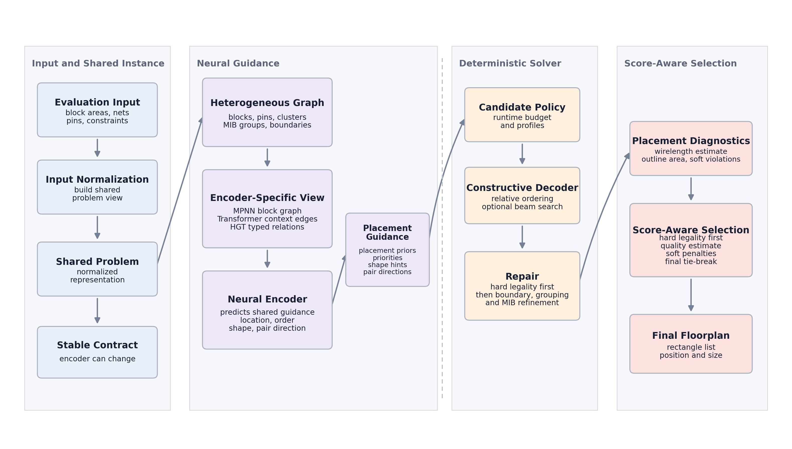
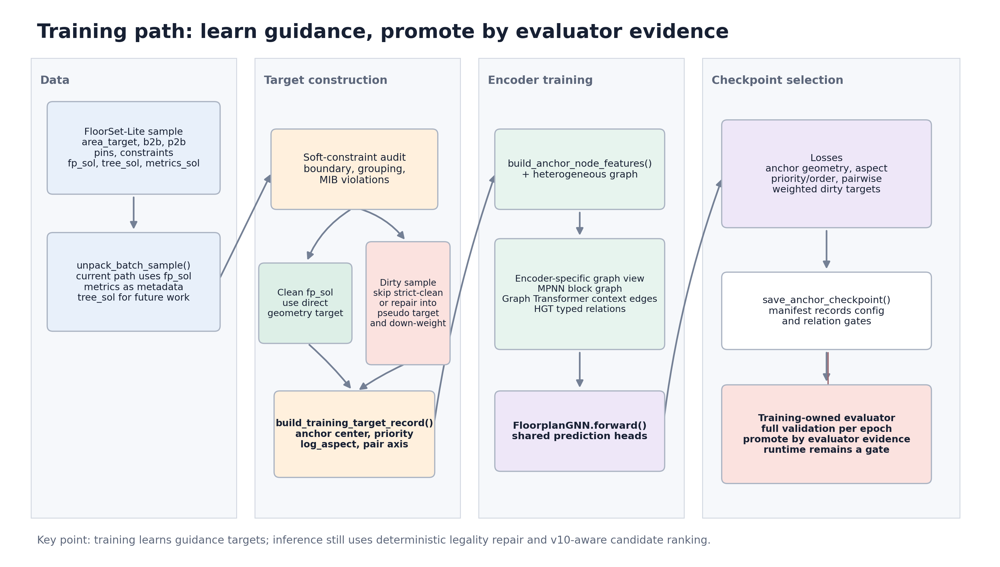

# ICCAD Problem C FloorSet Final Project Presentation

## Slide 1. Data-Driven SoC Floorplanning

**ICCAD Contest Problem C: The FloorSet Challenge****Final Project Presentation**

- Goal: generate legal and high-quality SoC floorplans from FloorSet instances
- Approach: learned guidance + constraint-aware deterministic decoding + repair
- Current system: Graph Transformer / HGT-compatible guidance with a shared v10-aware solver path

**中文說明：**
開場先說這個 project 的核心不是單純訓練一個 neural network 直接輸出 floorplan，而是把 learning model 當成 guidance。真正的 placement 還是透過 deterministic decoder、repair、candidate ranking 來確保合法性與穩定分數。這樣可以解釋為什麼我們的 architecture 一直在演化，但 downstream solver contract 保持一致。

---

## Slide 2. Problem Statement: Inputs and Outputs

**Input instance**

- Block information: number of blocks and target area of each block
- Netlist information: block-to-block connectivity and pin-to-block connectivity
- Pin information: pin coordinates
- Constraint information: fixed-shape, preplaced, multi-instantiation, clustering, and boundary constraints
- Optional training labels: `fp_sol`, `tree_sol`, and `metrics_sol`

**Output floorplan**

- For each block, output a rectangle:
  - `x`, `y`: lower-left position
  - `w`, `h`: width and height
- The final output must be evaluator-compatible and satisfy all hard constraints

**中文說明：**
這頁先定義問題的 I/O。Input 是 FloorSet instance，包括 blocks、nets、pins、constraints。Output 是每個 block 的 rectangle，也就是 `(x, y, w, h)`。訓練資料裡還有 `fp_sol`, `tree_sol`, `metrics_sol`，目前主要使用 `fp_sol` 來做 geometry target，`tree_sol` 和 `metrics_sol` 則是未來可以利用的 supervision 或 auxiliary signals。

---

## Slide 3. Problem Statement: Hard and Soft Constraints

**Hard constraints**

- No block overlap
- Area error must stay within tolerance
- Fixed-shape blocks must preserve required dimensions
- Preplaced blocks must preserve required position and dimensions
- Any hard-constraint violation makes the solution infeasible

**Soft constraints**

- Boundary constraints
- Grouping / clustering constraints
- Multi-instantiation block constraints

**Objective**

- Minimize wirelength gap, bounding-box area gap, soft-constraint violations, and runtime risk
- Feasibility is the first priority, quality is optimized after legality

**中文說明：**
這頁要強調 hard constraint 和 soft constraint 的差別。Hard constraint 一旦違反，case 會被視為 infeasible，分數會很差。Soft constraint 不一定直接 infeasible，但會進入 penalty，所以仍然會影響排名。我們的方法設計上先保證 hard legality，再用 repair 和 ranking 去降低 soft violations 和 quality cost。

---

## Slide 4. Problem Statement: PDF / Evaluator Update from v9 to v10

**Main changes from v9 to v10**

- v10 scoring makes large instances important, but not dominated by only one case
- Total validation score uses exponential block-count weighting
- Fixed-shape and preplaced legality are treated as hard feasibility conditions
- Boundary, grouping, and MIB constraints remain soft penalties
- The released local evaluator keeps the runtime term in the formula, but evaluates validation cases with neutral `RuntimeFactor = 1.0`
- Official leaderboard runtime can still differ because it depends on per-test-case cross-submission medians

**Design implication**

- Treat local v10 validation cost as a no-runtime / neutral-runtime quality surface
- Use average, p90, and max runtime as gating signals
- Keep runtime-aware analysis as a submission-risk sanity check, not the main local architecture metric

**中文說明：**
這頁解釋為什麼 v9 到 v10 後，我們的 evaluation policy 要改。v9 時比較容易誤以為最後幾個大 case 完全主導分數，但 v10 的 weighting 讓整體 validation 更重要。更重要的是，`iccad2026_evaluate.py` 的公式仍然有 runtime term，但本地 validation 因為沒有官方「同一 test case 上所有 submission 的 median runtime」，所以把 `RuntimeFactor` 固定成 1.0，也就是 neutral runtime。這代表 local v10 cost 本質上比較接近 no-runtime / quality surface；runtime 仍然要看，但比較適合作為 gate 和 final submission risk sanity check。

---

## Slide 5. Related Work and Design Context

**Classical floorplanning**

- Constructive placement methods
- B*-tree and sequence-pair representations
- Simulated annealing and search-based optimization
- Legalization and repair after initial placement

**Learning-based EDA**

- GNNs for netlist and block-relationship modeling
- Learned placement priors for better initial solutions
- Data-driven ranking or guidance for optimization

**Our positioning**

- We do not rely on a neural model alone
- We combine learned priors with a deterministic, constraint-aware solver
- The model predicts guidance; the solver produces legal placements

**中文說明：**
這頁可以用來說明我們不是從零發明 floorplanning。傳統方法常用 B*-tree、sequence pair、SA 或 search。Learning-based EDA 則常用 GNN 來理解 netlist。我們的方法是 hybrid：model 負責提供 prior，例如 anchor、priority、aspect、pairwise direction；solver 負責 placement、repair、ranking。這樣比純 neural output 更穩定，也比純 heuristic 更能利用 training data。

---

## Slide 6. Proposed Methodology: Core Idea

**Core idea**

- Convert each FloorSet instance into a constraint-aware graph-guided placement problem
- Use a neural encoder to predict reusable guidance signals
- Decode guidance into multiple candidate placements
- Repair candidates using constraint-aware geometry rules
- Select the best candidate using v10-aware ranking

**Heterogeneous floorplan representation**

- Blocks, pins, clusters, MIB groups, and boundary requirements are different semantic objects
- The Graph Transformer path derives typed context edges from the explicit heterogeneous floorplan graph
- The HGT path keeps typed nodes and typed relations directly:
  - `block -> block`: connectivity
  - `block -> pin`: pin connectivity
  - `block -> cluster`: grouping membership
  - `block -> mib`: same-shape relation
  - `block -> boundary`: boundary requirement
- All encoders still emit the same `AnchorGuidance` contract for the decoder

**Why this design works**

- Learning improves layout quality by predicting useful geometric priors
- Heterogeneous graph modeling keeps netlist, pin, and constraint semantics visible to the encoder
- Deterministic decoding keeps the solver stable and evaluator-compatible
- Repair protects feasibility under hard and soft constraints
- Candidate ranking separates model prediction from final scoring decisions

**中文說明：**
這頁是整體方法的核心，也要補上 heterogeneous graph 的角色。FloorSet 不是只有 block-to-block netlist；它還有 pin、cluster、MIB、boundary 等不同語意的 constraint object。如果只把它當普通 block graph，模型會比較難分清楚「兩個 block 有 net 相連」和「兩個 block 屬於同一個 MIB group」這兩種關係。現在 codebase 裡 Graph Transformer 會從 explicit heterogeneous floorplan graph 抽出 typed context edges；HGT 則更直接，把 block、pin、cluster、MIB、boundary 做成 typed nodes，再用 typed relations 做 attention。不過這些 encoder 最後都要輸出同一個 `AnchorGuidance`，所以 heterogeneous graph 只改變 model 如何理解 instance，不會直接改掉 decoder、repair、ranking。

---

## Slide 7. Proposed Methodology: Architecture Evolution

| Stage                 | Main Design                                                               | What We Learned                                                                   | Reason for Change                                                      |
| --------------------- | ------------------------------------------------------------------------- | --------------------------------------------------------------------------------- | ---------------------------------------------------------------------- |
| Early GNN / MPNN      | Block graph with connectivity-based message passing                       | Learned guidance is useful, but constraint context is limited                     | Need richer representation for pins, clusters, MIB, and boundaries     |
| Relative-order solver | Deterministic decoder with learned anchor and priority hints              | Solver stability is essential for 100/100 feasibility                             | Keep neural output as guidance instead of direct placement             |
| Graph Transformer     | Add richer graph attention and structural context                         | Better full-validation quality than older MPNN checkpoints                        | Preserve the same downstream solver while improving encoder capacity   |
| HGT exploration       | Typed nodes and typed relations for blocks, pins, clusters, MIB, boundary | Heterogeneous modeling is promising but needs evaluator-backed promotion          | Do not promote by validation loss alone                                |
| v10 control layer     | v10 proxy ranking, runtime gates, narrow grouping pair bias               | Small targeted controls help; broad portfolio and hard runtime clamps can regress | Tune with full-validation `total_score_no_runtime` and runtime gates |

**中文說明：**
這頁是 architecture evolution table。重點不是把每個 branch 都講成成功，而是講我們從每次嘗試學到什麼。GNN 證明 learned guidance 有用，但 context 不夠；Graph Transformer 讓 representation 更豐富；HGT 嘗試 typed heterogeneous graph，但還不能只靠 validation loss promotion；v10 control layer 則讓我們把 scoring policy、runtime、soft constraints 的 trade-off 放在共同控制層處理。

---

## Slide 8. Proposed Methodology: Latest Overall Architecture

```text
Training path
FloorSet-Lite samples
  -> instance parser and label cleaning
  -> heterogeneous graph construction
  -> encoder-specific graph view
  -> GNN / Graph Transformer / HGT encoder
  -> shared heads
  -> anchor, priority, log-aspect, pairwise-axis supervision

Inference path
Evaluator instance
  -> parser
  -> heterogeneous graph construction
  -> neural guidance
  -> constraint-aware decoder
  -> repair
  -> candidate ranking
  -> final placement
```

**Shared solver contract**

- `Instance`: normalized problem representation
- `HeteroFloorplanGraph`: explicit semantic graph for pins and constraints
- `AnchorGuidance`: model predictions converted into solver hints
- `Placement`: evaluator-ready rectangle solution
- Encoder can change; decoder, repair, and ranking contract stay stable

**中文說明：**
這頁講最新整體 architecture。Training path 和 inference path 要分開講：training 從 FloorSet-Lite sample 產生 labels 和 graph input；inference 從 evaluator instance 開始，不一定有 label，只能用 model guidance 和 solver。這裡要特別說明 graph construction 不是單一格式，而是先保留 heterogeneous floorplan semantics，再依 encoder 轉成不同 view：MPNN 使用較 compact 的 block graph，Graph Transformer 使用 typed context edges，HGT 使用 typed nodes 和 typed relations。最重要的一句是：encoder 可以從 GNN 換成 Graph Transformer 或 HGT，但只要輸出 shared heads，下游 decoder 和 repair 就能共用。

---

## Slide 9. Latest Architecture: Inference Path Details



**Inference path**

1. **Instance parsing**

   - Convert evaluator tensors into an `Instance`
   - Normalize block areas, nets, pins, and constraints
2. **Guidance generation**

   - Build graph input for the selected encoder
   - Run the neural model
   - Convert predictions into `AnchorGuidance`
3. **Decoder**

   - Use anchors, priorities, aspect hints, and pairwise-axis logits
   - Construct relative ordering and initial block rectangles
4. **Repair**

   - Fix hard legality first
   - Then reduce boundary, grouping, and MIB soft violations
5. **Placement selection**

   - Rank candidates using hard legality, v10 proxy cost, soft penalties, and quality metrics
   - Return final `(x, y, w, h)` placement list

**中文說明：**
這頁要更細地說 inference。第一步 parser 把 evaluator input 變成內部 `Instance`。第二步 model 產生 guidance，例如 block anchor、priority、aspect ratio、pairwise orientation。第三步 decoder 根據 guidance 生成初始 placement。第四步 repair 先修 hard constraint，再處理 soft constraint。第五步 ranking 選 candidate，最後輸出 evaluator 需要的 rectangle list。

---

## Slide 10. Latest Architecture: Training Path Details



**Training path**

1. Load FloorSet-Lite sample
2. Extract instance tensors and `fp_sol`
3. Detect clean and dirty samples using soft-constraint checks
4. Build training target record
5. Optionally repair dirty labels into pseudo targets
6. Build encoder-specific graph inputs
7. Train shared prediction heads

**Training outputs**

- Anchor center target
- Priority target
- Log-aspect target
- Pairwise relation / axis target

**Why shared heads matter**

- GNN, Graph Transformer, and HGT can be compared fairly
- Downstream decoder receives the same guidance format
- Architecture changes are isolated to the encoder and graph builder

**中文說明：**
這頁說 training path。訓練時最重要的是資料不是完全乾淨，所以要先檢查 `fp_sol` 是否有 soft violations。乾淨資料可以直接當 target；dirty sample 則要降權、跳過部分 supervision，或透過 repair 產生 pseudo target。shared heads 讓不同 encoder 公平比較，因為它們都輸出相同格式的 guidance。

---

## Slide 11. Implementation: Dataset Format and Target Construction

**FloorSet-Lite fields**

| Field                     | Meaning                                            | Current Use                                           |
| ------------------------- | -------------------------------------------------- | ----------------------------------------------------- |
| `area_target`           | Target area for each block                         | Model input and hard-area reference                   |
| `b2b_connectivity`      | Block-to-block nets                                | Graph edges and connectivity features                 |
| `p2b_connectivity`      | Pin-to-block nets                                  | Pin and net context                                   |
| `pins_pos`              | Pin coordinates                                    | Graph features and placement context                  |
| `placement_constraints` | Fixed, preplaced, MIB, cluster, boundary flags     | Constraint-aware features and repair rules            |
| `fp_sol`                | Reference rectangles                               | Main geometry supervision                             |
| `tree_sol`              | B*-tree-like floorplan structure                   | Not used in current training path                     |
| `metrics_sol`           | Area, pin, net, wirelength, and constraint metrics | Mostly metadata today; useful future auxiliary signal |

**Dirty sample handling**

- Clean samples provide direct geometry and ordering supervision
- Dirty samples are detected by soft-constraint violations
- Repaired pseudo targets can recover useful supervision
- Risky dirty labels receive lower or suppressed order/pairwise weights

**中文說明：**
這頁是 implementation 裡 training dataset 的核心。要特別講 `fp_sol` 是目前主要 supervision，`tree_sol` 和 `metrics_sol` 雖然資料裡有，但目前沒有充分使用。dirty sample 是很重要的工程問題，因為 contest data 的 solution label 不一定完全符合我們的 constraint policy，所以不能盲目拿來訓練。現在的處理方式是 clean 直接用，dirty 要檢查、修復或降權。

---

## Slide 12. Implementation: From GNN to Graph Transformer to HGT

| Encoder           | Representation                                  | Strength                                | Limitation / Status                                                |
| ----------------- | ----------------------------------------------- | --------------------------------------- | ------------------------------------------------------------------ |
| GNN / MPNN        | Blocks as nodes, connectivity as edges          | Simple, stable, strong early baseline   | Hard to represent heterogeneous constraints explicitly             |
| Graph Transformer | Richer attention over structural graph context  | Current strong production-style encoder | Still maps heterogeneous objects into a mostly shared graph format |
| HGT               | Typed nodes: block, pin, cluster, MIB, boundary | Better match to FloorSet semantics      | Promising, but requires evaluator-backed promotion                 |

**Shared prediction heads**

- `anchor`: predicted center prior for each block
- `priority`: ordering and placement priority
- `log_aspect`: shape preference for soft blocks
- `pair_logits`: pairwise horizontal / vertical relation hints

**中文說明：**
這頁講 encoder 演化。GNN 是最早穩定 baseline，但 heterogeneous constraints 表達力有限。Graph Transformer 加入更強的 attention 和 structural context，目前是主要 production-style path。HGT 則把 block、pin、cluster、MIB、boundary 做成不同 node type，更符合 FloorSet 語意，但是否 default 要看 full evaluator evidence，不是只看 validation loss。shared heads 則是三種 encoder 的共同輸出介面。

---

## Slide 13. Implementation: Constraint-Aware Decoding and Repair

**Constraint-aware decoding**

- Start from learned anchors and placement priorities
- Use log-aspect predictions to guide soft-block shape
- Use pairwise-axis logits to resolve ambiguous relative order
- Generate candidate placements instead of committing to one neural prediction

**Repair strategy**

- Hard legality first:
  - area tolerance
  - fixed-shape legality
  - preplaced legality
  - overlap removal
- Soft-constraint improvement second:
  - boundary snapping
  - grouping / cluster cohesion
  - MIB shape consistency
- Candidate acceptance is controlled by v10-aware ranking

**中文說明：**
這頁是 implementation 第二部分：decoder 和 repair。Decoder 不是任意放 block，而是根據 anchor、priority、aspect、pairwise direction 建立 relative-order placement。Repair 的順序很重要：先確保 hard legality，因為 hard violation 會直接 infeasible；再改善 soft constraints。最後不是 repair 完就一定接受，而是要透過 v10 proxy 和 ranking 判斷 candidate 是否真的比較好。

---

## Slide 14. Experimental Results: Architecture Performance Comparison

**Note: scoring policy changed over time, so this table should be read as an evolution summary, not a single unified leaderboard.**

| Version / Checkpoint           |                 Metric Context |                                        Key Result | What We Learned                                                                                        | Reason for Next Change                               |
| ------------------------------ | -----------------------------: | ------------------------------------------------: | ------------------------------------------------------------------------------------------------------ | ---------------------------------------------------- |
| v3 local runtime-aware path    | Runtime-aware local validation |              about 2.33 to 2.65, 100/100 feasible | Feasibility was stable, but local runtime-aware score was noisy                                        | Separate architecture quality from runtime artifacts |
| MPNN 200k promotion            |        Pre-v10 full validation |                   total 2.0002, no-runtime 1.9560 | Learned anchor guidance clearly improved deterministic placement                                       | Train larger and compare by full evaluator evidence  |
| No-checkpoint guidance mode    |                Full validation | total 6.2174, no-runtime 4.6289, 100/100 feasible | Deterministic repair can preserve legality, but initial solution quality strongly limits final score   | Keep neural guidance in the production path          |
| Configured Anchor-GNN          |                Full validation | total 3.2697, no-runtime 2.0326, 100/100 feasible | Production guidance path was robust, but block-level representation still limited constraint reasoning | Improve encoder expressiveness                       |
| Graph Transformer 0521         |           v10 checkpoint sweep | no-runtime 2.1194, total 2.6641, 100/100 feasible | Richer structural context became the strongest current checkpoint                                      | Keep as default while testing targeted v10 controls  |
| HGT validation-loss checkpoint |           v10 checkpoint sweep | no-runtime 2.2144, total 2.7476, 100/100 feasible | Typed heterogeneous modeling is promising but not yet superior                                         | Promote only after evaluator-backed improvement      |

**中文說明：**
這頁的重點是「architecture evolution 的實驗證據」。因為 scoring policy 期間有改，所以不能把所有數字當成完全同一 leaderboard。你可以說我們從 v3 開始已經能保持 100/100 feasible，但後來發現 runtime-aware local score 太 noisy，所以改用 no-runtime score 來比較 architecture。No-checkpoint baseline 證明 solver 本身可以合法，但也說明初始解品質很重要：如果一開始沒有 learned anchor guidance，後面的 repair 和 ranking 很難完全補回 HPWL、area、soft constraint 的品質差距。Configured Anchor-GNN 則不是再證明 learned guidance 有用，而是證明 production guidance path 已經穩定；下一個瓶頸變成 block-level MPNN representation 對 pin、cluster、MIB、boundary constraint 語意的表達能力不足，所以才推進到 Graph Transformer。Graph Transformer 則是目前 v10 sweep 裡表現最穩的主力 checkpoint。HGT 還有潛力，但不能因為 validation loss 好就直接 promotion。

---

## Slide 15. Experimental Results: v10 Version Ablation

**Fresh same-machine v10 ablation**

The released local evaluator uses neutral `RuntimeFactor = 1.0`; the diagnostic total below is kept as a runtime-risk comparison surface from our project scripts.

| Configuration                                  | No-Runtime Score | Diagnostic Total | Feasible | Avg / P90 / Max Runtime | Decision                                      |
| ---------------------------------------------- | ---------------: | ---------------: | -------: | ----------------------: | --------------------------------------------- |
| Merge-base baseline                            |           2.2184 |           2.7762 |  100/100 |    1.25 / 2.27 / 7.01 s | Baseline                                      |
| Phase 1: v10 proxy default                     |           2.1634 |           2.7471 |  100/100 |    1.24 / 2.12 / 7.42 s | Keep default                                  |
| Phase 1 + v10 soft repair                      |           2.1446 |           2.8314 |  100/100 |    1.40 / 2.46 / 9.64 s | Opt-in only                                   |
| Phase 1 + soft repair + conditional budget     |           2.1670 |           2.7207 |  100/100 |    1.22 / 2.56 / 5.70 s | Useful for diagnostic total/runtime, not main |
| Phase 1 + narrow grouping pair bias            |           2.1538 |           2.6993 |  100/100 |    1.23 / 2.24 / 6.58 s | Promote default                               |
| Phase 1 + conditional budget + narrow grouping |           2.1926 |           2.7515 |  100/100 |    1.18 / 2.13 / 5.79 s | Do not combine by default                     |

**What we learned**

- v10 proxy ranking improves architecture quality without hurting feasibility
- Narrow grouping pair bias is a targeted default improvement
- Broad soft repair and conditional budget can help some metrics but may regress the main no-runtime score
- Runtime should be gated, not over-optimized by hard clamps

**中文說明：**
這頁是 v10 ablation。你可以先補一句：官方釋出的 local evaluator 在 validation 時把 `RuntimeFactor` 固定成 1.0，所以 local official cost 是 neutral-runtime；表格裡的 diagnostic total 是我們 repo 內部用來看 runtime risk 的比較面，不要和官方 local neutral cost 混在一起。最後 decision 不是選分數最低的單一 row，而是根據 promotion policy。主指標是 no-runtime score，所以 Phase 1 v10 proxy 和 narrow grouping pair bias 是比較穩的 default。Soft repair 雖然 no-runtime 有時看起來好，但 diagnostic total 或 max runtime 會變差，因此只保留 opt-in。Conditional budget 對 runtime risk 有幫助，但和 narrow grouping 組合後 no-runtime 反而退步，所以不設成 default。

---

## Slide 16. Conclusion

**Summary**

- The final system is a hybrid floorplanning solver:
  - neural guidance for geometry priors
  - deterministic decoding for stable placement construction
  - repair for hard and soft constraints
  - v10-aware ranking for candidate selection
- The architecture evolved from GNN to Graph Transformer and HGT-compatible design
- The most important engineering lesson is to keep the solver contract stable while improving the encoder and control layer
- Local full-validation v10 score is neutral-runtime by construction; raw runtime remains a gate and final leaderboard risk signal

**中文說明：**
結論頁要收斂成三個重點。第一，我們的方法是 hybrid，不是純 ML，也不是純 heuristic。第二，architecture evolution 的核心是 shared contract，encoder 可以換，但下游 solver 穩定。第三，v10 後的 evaluation policy 很重要，不能只看單 case；而且本地 evaluator 已經把 runtime factor neutralize 成 1.0，所以 local full-validation score 更適合作為 architecture quality 指標，再用 raw runtime、p90 runtime、max runtime 來控制官方 leaderboard 的 runtime 風險。

---

## Slide 17. Future Work

**Decoder replacement or upgrade**

- Replace the current relative-order decoder with a stronger learned or search-based decoder
- Explore B*-tree, skyline, maximal-empty-rectangle, or beam-search decoding
- Keep hard legality and repair as mandatory safety layers

**Use currently underused dataset fields**

- `tree_sol`
  - Train a tree-aware decoder
  - Supervise parent-child or sibling placement relations
  - Generate topology candidates before geometric repair
- `metrics_sol`
  - Train auxiliary prediction heads for wirelength, area, and difficulty
  - Build a learned v10 proxy or risk estimator
  - Use metrics for curriculum learning and runtime-budget prediction

**HGT continuation**

- Promote HGT only with full evaluator evidence
- Analyze relation gates to understand which typed relations matter
- Add global refinement only if it improves v10 score without runtime regression

**中文說明：**
Future work 可以講三條線。第一是 decoder，現在 relative-order decoder 雖然穩，但未來可以換成更強的 tree-aware 或 search-based decoder。第二是資料利用，`tree_sol` 很適合拿來學 topology，`metrics_sol` 很適合做 auxiliary learning 或 learned proxy。第三是 HGT，不要急著 default，要先用 evaluator evidence 證明它真的比 Graph Transformer 好。這樣結尾會很自然，也能顯示你知道目前系統的限制在哪裡。
