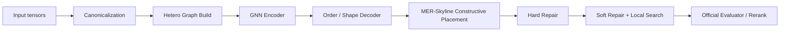

# 約束感知的圖式建構式 Floorplanner 分析報告

## Executive Summary

對 FloorSet 這類資料驅動 SoC floorplanning 競賽，最適合的主線方法不是純座標回歸，也不是從零開始的純 RL；更合理的是**約束感知的圖式建構式模型**：先用 hetero GNN / hypergraph encoder 讀入 netlist、pins 與 constraint，再用**可合法構造的 decoder**逐步放置 block，最後用 repair 與小型 local search 做精修。這樣做和官方介面、評分函數與資料型態最一致：官方 `solve()` 的輸入就是 `area_targets / b2b_connectivity / p2b_connectivity / pins_pos / constraints`，訓練資料有 100 萬筆，但官方提供的 differentiable proxy loss **不含 fixed/preplaced/MIB/group/boundary 的精確檢查**，因此若不把 legality 與 constraint-aware repair 放進方法本體，validation 代理 loss 與最終分數很容易脫鉤。

本報告建議的具體型態是：**graph encoder + order/shape decoder + MER/skyline constructive placer + exact repair + incremental local search**。在表示法選擇上，**runtime 主表示法建議用 MER/skyline 混合**，而不是純 CBL 或純 B\*-tree：CBL 與 B\*-tree 很適合做理論參照、supervision target 或 search neighborhood，但遇到 preplaced block、障礙洞、以及 group/MIB 邊走邊維護時，MER 对「可放位置枚舉」與「mask legality」更直接；skyline 則很適合後續 compaction。這個設計同時吸收了 CBL 的可構造性、B\*-tree 的高效評估、GraphPlanner / Graph Attention 的圖表徵、以及解析式 placer / repair tool 的工程優點。

以你的硬體來看，這條路線是可落地的：單張 L4 24GB 足以訓練中型 GNN + pointer-style decoder，64-core CPU server 很適合做 graph cache、beam rerank、overlap/legality 檢查與 local search；如果控制在 30 萬到 60 萬樣本、6 層 256 hidden 的模型，通常可在數天內做完第一輪競賽級訓練。citeturn10view0turn15view0turn15view1

**重點摘要：**最佳主線是「圖模型負責理解結構，建構式 decoder 負責合法生成，repair/search 負責最後一公里」。
**重點摘要：**在 FloorSet 上，constraint handling 不是附屬模組，而是模型設計核心。

## 問題定位與假設

官方 README 明確定義：訓練集 100 萬筆、validation 100 筆、hidden test 100 筆，尺寸皆為 21–120 blocks；硬限制是**不可重疊、soft block 面積誤差 1% 內、fixed-shape / preplaced block 尺寸與位置精確**；軟限制只剩 **grouping、MIB、boundary**；評分是 `Cost = (1 + 0.5*(HPWL_gap + Area_gap)) * exp(2*V_rel) * max(0.7, RuntimeFactor^0.3)`，且大案例以指數權重影響總分。citeturn10view0

以下分析採用三個實作假設。第一，訓練資料先用 30 萬筆做主訓練，再視時間擴到 60 萬筆；第二，large case 單題可接受 inference latency 約 2–8 秒；第三，主系統以 Linux + CUDA 為核心，Mac mini 只做 debug、視覺化與小規模 ablation。這些假設與官方資料規模、速度因子封頂、以及你目前的 L4/CPU 配置相容。citeturn10view0

**重點摘要：**這題是「有大量標註的結構化產生 + 嚴格合法化」問題，不是典型 sparse-reward RL 任務。
**重點摘要：**你真正要優化的是 large-case 可行率、group/MIB/boundary 處理，和低成本 refinement。

## 整體 Pipeline

我建議的 pipeline 如下：先做**instance canonicalization**與 graph construction，再用**heterogeneous GNN encoder**產生 block / pin / constraint embeddings；decoder 先預測放置順序與 shape latent，再於每一步從**最大空矩形（MER）/ skyline frontier**中選合法候選，配合 masking 直接避免 overlap 與 fixed/preplaced 錯誤；最後做 hard repair、soft repair、incremental local search，並以官方 evaluator 做 rerank 與自動驗證。這種「encoder→constructive placer→repair」的分工，和 FloorSet 介面、CBL/B\*-tree 的構造思想，以及 DREAMPlace / Hier-RTLMP 那種「先給好初始化，再由後段工具 refine」的做法高度一致。citeturn10view0turn12search4turn6view3turn5view6turn5view4



```text
[area_targets, b2b, p2b, pins, constraints]
                   │
                   ▼
        [block/pin/group/mib hetero graph]
                   │
            z_block, z_pin, z_group
                   │
     [pointer order] + [aspect latent r] + [slot logits]
                   │
         [MER candidates + legality masks]
                   │
             provisional floorplan states
                   │
      [repair / compact / local search / score]
                   ▼
              final (x, y, w, h)
```

核心步驟可概括如下。

| 模組                | 輸入                         | 輸出                         | 核心做法                                                                  |
| ------------------- | ---------------------------- | ---------------------------- | ------------------------------------------------------------------------- |
| Canonicalization    | pins、preplaced、GT solution | 正規化座標與對應 target      | 平移到一致參考框架、對稱增強、group 內排序穩定化                          |
| Graph build         | connectivity + constraints   | hetero graph                 | block/pin/group/MIB 節點；weighted edges 與 membership edges              |
| Encoder             | hetero graph                 | per-node / global embeddings | edge-aware GNN / graph transformer                                        |
| Decoder             | embeddings + partial state   | next block, aspect, slot     | pointer + slot scorer；mask 違法動作                                      |
| Constructive placer | action + state               | provisional placement        | MER 枚舉、skyline compaction、incremental cost                            |
| Repair/search       | provisional placement        | legal / lower-cost placement | overlap resolve、group connect、MIB unify、boundary push、swap / reinsert |
| Scoring             | candidate solutions          | best JSON solution           | 官方 evaluator、`--score`、`--validate` 自動迴圈                      |

核心演算法可寫成：

```python
def solve(instance):
    inst = canonicalize(instance)
    state0 = init_with_preplaced(inst)      # preplaced 先鎖定
    G = build_hetero_graph(inst, state0)
    Z = encoder(G)

    beams = [state0]
    for t in range(num_unplaced(inst)):
        cand = []
        for s in beams:
            blk_scores = block_head(Z, s, mask=s.remaining_mask)
            for b in topk_blocks(blk_scores):
                r = choose_aspect_code(Z, s, b)          # soft block only
                slots = enumerate_MER_and_frontier(s, b, r)
                slot_scores = slot_head(Z, s, b, slots, legality_mask=True)
                for u in topk_slots(slot_scores):
                    s2 = place_update(s, b, r, u)
                    s2.score = s.score + prior(s2) + delta_proxy(s2)
                    cand.append(s2)
        beams = diverse_topk(cand)

    sols = [repair_and_local_search(s) for s in beams]
    return best_by_exact_eval(sols)
```

**重點摘要：**主體不是「直接預測座標」，而是「預測一連串合法放置決策」。
**重點摘要：**MER/skyline 讓 legality 變成 action mask 問題，而不是事後大修。

## 核心模組細節

**資料前處理與 canonicalization。**
因為 pins 與 preplaced 給了絕對幾何參考，建議把**整個 instance 一起**正規化，而不是只平移 block label：以 pins/preplaced 的外接框中心作平移基準，block 與 pins 同步轉換，再於輸出端 inverse-transform 回原座標。額外做兩種 augmentation：左右/上下鏡射（同步重寫 boundary label），以及 group 內同構 block 的穩定排序。這能減少 label symmetry 與 decoder mode collapse。citeturn10view0turn6view1

**Graph construction 與 encoder。**
圖建議做成 **heterogeneous factor graph**：block node 帶 `log(area)`、degree、fixed/preplaced flag、boundary type、group/MIB id、target `(w,h)`；pin node 帶座標；group/MIB 則是 constraint node。邊型至少包含 `block↔block`、`block↔pin`、`block↔group`、`block↔mib`。若你想保留高階 net 結構，可把 pin / constraint node 視為 hyperedge proxy，這與 KDD 2022 的 Hypergraph Embedding 思路一致；實作上建議 6 層 edge-aware Graph Transformer 或 GINE + attention，hidden 256、8 heads、全域 token 一個。citeturn16search1turn7view1turn17search7

**Decoder 與表示法選擇。**
純 CBL 的優點是線性時間重建、對 size 變化友善；B\*-tree 則有一對一 admissible placement 與高效增量評估；但這兩者對「已有 preplaced obstacle 的連續幾何可行域」不如 MER 直接。因此我建議：**訓練時可使用 CBL/B\*-tree 衍生 supervision signal；runtime 則用 MER/skyline 混合表示**。action factorization 為 `a_t = (next_block, aspect_code, candidate_slot, optional_orientation)`；其中 slot 來自 MER 列表、group frontier、boundary frontier。

**Area-preserving 參數化與 legality。**
soft block 不直接預測 `(w,h)`，而預測 `r=log(w/h)`，再以 `w=sqrt(A*e^r), h=sqrt(A/e^r)` 保證面積守恆；固定形狀與 preplaced block 則完全覆寫為指定尺寸，preplaced 連位置也直接鎖死。legality mask 分三層：`remaining-mask` 防重複選塊，`shape-mask` 防 fixed/MIB 錯形，`slot-mask` 防 overlap 與 preplaced 衝突。這樣硬限制在 decode 時就已大部分滿足。citeturn10view0turn6view3

**Group / MIB / boundary 處理。**
grouping 與 MIB 在競賽裡是 soft，但不應只留給 loss。做法是：group 第一次被放置時建立 group hull，後續成員優先只在 hull frontier 上選 slot，讓它們自然 abut；MIB 則讓第一個成員決定群組共享 `r_g`，其餘成員重用。boundary 因是**相對最終 bounding box**的軟限制，最穩做法不是早期硬鎖，而是「decode 時強偏壓到當前 frontier，final repair 再做 edge push」。citeturn10view0turn6view5

**Inference-time beam / ensemble / repair。**
建議 size-aware beam：`n<80` 用 4，`80≤n<100` 用 8，`n≥100` 用 12–16；temperature 前高後低，並以 diverse beam 避免所有 beam 收斂到同一拓樸。repair 順序是：先 hard repair（exact dims / preplaced snap / overlap resolve），再 MIB unify，再 group connect，最後 boundary push 與 compaction。local search 只保留 4 類鄰域：reinsert、swap order、small aspect tweak、group bridge；每次用增量 HPWL 與 bbox delta 算成本。這種「學習初始化 + 小搜索」也呼應了 local-search-heuristic 與 CORE 的經驗。citeturn9view2turn5view5

**重點摘要：**表示法最佳實務不是二選一，而是「CBL/B\*-tree 提供結構觀念，MER/skyline 提供 runtime legality」。
**重點摘要：**fixed/preplaced 要在 decode 層級處理；group/MIB/boundary 要在 decode 與 repair 兩層同時處理。

## 理論背景與方法比較

這個方法背後的理論可分成五塊。第一，**GNN / hypergraph embedding**：floorplanning 的關鍵訊號來自 connectivity、pins、group/MIB 關係，天然適合圖模型；GraphPlanner、Graph Attention、EAGAT 都支持「圖特徵 ≫ 純影像/純 MLP」這個判斷。第二，**結構表示法**：sequence-pair、CBL、B\*-tree 都是把 NP-hard 搜尋空間壓縮成可操作的拓樸空間；其中 CBL 能線性重建且與 block size 分離，B\*-tree 對增量操作與 admissible placement 特別強。第三，**packing / legalization**：MER、skyline、constraint graph、compaction 都屬於把幾何可行性從「loss 希望學到」轉成「演算法直接保證」。第四，**search / EA / SA**：在大案例上，少量但高品質的後段搜索仍然有價值。第五，**生成式比較**：diffusion / flow matching 很擅長多模態與 zero-shot 產生，但 sample-time latency 與精確 legality 仍不如 constructive decoder 直接；因此它們更適合作為第二條研究線，而非本題主解。citeturn7view1turn17search0turn17search7turn13search0turn12search4turn6view3turn6view5turn6view1turn20search1turn20search13

就文獻脈絡而言，entity["company","Google","technology company"] 的 Circuit Training / AlphaChip 證明了 edge-based GCN + RL 可行，但也非常仰賴 pretraining、actor infrastructure 與大量算力；entity["organization","TILOS AI Institute","research institute"] 的 MacroPlacement 則進一步顯示，更強的 SA baseline 與完整後端評測常能逼近甚至超越 RL。相對地，GraphPlanner、CBL-hypergraph、MaskPlace、chipdiffusion、FlowPlace 等工作共同支持一個更貼近競賽的結論：**離線資料、圖結構、可控 legality、以及 inference-time guidance**，比純線上訓練更符合高保真 floorplanning 任務。citeturn5view3turn18search0turn18search1turn18search2turn19view0turn7view1turn16search1turn6view2turn6view1turn20search1

**重點摘要：**理論上最關鍵的是「把幾何可行性嵌入表示法與解碼器」，而不是把所有事情丟給 loss。
**重點摘要：**這也是建構式模型在本題優於純 diffusion / 純 RL 的主因。

## 工程實作與訓練驗證

框架建議用 **PyTorch + PyG** 為主，DGL 作備選。官方文件顯示目前 PyTorch stable 為 2.7.0，要求 Python 3.10+；PyG 官方文件也強調 CUDA / PyTorch 版本必須對齊，若 wheel 不支援則需 source build。考慮你的 driver 顯示 CUDA 12.2，我會以 **Python 3.10/3.11 + PyTorch pip stable + PyG 對應 wheel** 為首選；若要最穩定，寧可選較保守的 CUDA wheel 組合，也不要在 L4 上追最新 nightly。citeturn15view0turn15view1

資料 pipeline 建議分三層快取：原始 tensor、graph object、candidate-slot cache。batching 則以 block_count bucket 化，避免 21-block 與 120-block 混在一起浪費 padding；混合精度可開 bf16/fp16，optimizer 用 AdamW。loss 不要只用官方 differentiable proxy，因為官方已明說它**不含 fixed、preplaced、MIB、cluster、boundary 的最終評估條件**；你應額外加上 `order imitation loss + slot classification + shared-aspect MIB loss + group-connect surrogate + boundary distance hinge + listwise ranking loss`。validation 指標則至少包含：feasible rate、exact preplaced hit rate、MIB satisfied ratio、group connected ratio、boundary hit ratio、官方 evaluator score。citeturn10view0

官方 evaluator 已提供 `--evaluate`、`--score`、`--validate`、`--save-solutions`，所以工程上最重要的是把訓練 loop 與 evaluator 自動串起來：每 N 個 epoch 存一批 validation JSON、直接重評分，再以 large-case weighted score 做 early stopping，而不是只看訓練 loss。citeturn10view0

```bash
python iccad2026_evaluate.py --evaluate my_optimizer.py --save-solutions
python iccad2026_evaluate.py --score my_optimizer_solutions.json
python iccad2026_evaluate.py --validate my_optimizer.py
```

硬體分工建議很明確：Mac mini 負責可視化、unit tests、資料檢查；L4 負責模型訓練與 small-batch beam inference；64-core server 負責 graph cache、parallel rerank、repair/local search 和 validation 全掃。這樣能最大化單卡 GPU 的利用率，同時把最吃 CPU 的 legality/search 分流出去。citeturn10view0turn15view0

**重點摘要：**工程上最重要的是 evaluator-in-the-loop，而不是只做神經網路訓練。
**重點摘要：**PyTorch + PyG 最符合你目前單卡 L4 的生態與維護成本。

## 資源估算與風險里程碑

以下是務實估算，基於你提供的單張 L4 24GB、64-core CPU server 與官方資料量級。官方自動下載說明顯示訓練資料約 15GB、validation 約 15MB；若再加 graph cache 與候選 slot 快取，建議至少預留 60–120GB 磁碟空間。citeturn10view0

| 階段       |    樣本量 | 估計 GPU 時間 |   CPU/磁碟 | 交付物                   |
| ---------- | --------: | ------------: | ---------: | ------------------------ |
| Prototype  |  5–10 萬 |    6–12 小時 |   30–50GB | 可跑通、基本合法         |
| Baseline+  | 20–30 萬 | 1–2 GPU-days |      60GB+ | beam + repair + 自動評測 |
| Contest 級 | 30–60 萬 | 3–6 GPU-days | 100GB 左右 | large-case 穩定、可提交  |

| 推薦超參數      | 建議值                             |
| --------------- | ---------------------------------- |
| encoder layers  | 6                                  |
| hidden dim      | 256                                |
| attention heads | 8                                  |
| beam size       | 4 / 8 / 12–16（依 size）          |
| batch policy    | size bucket                        |
| optimizer       | AdamW, lr 1e-4 起                  |
| mixed precision | bf16/fp16                          |
| warmup          | 3–5% steps                        |
| curriculum      | 先小尺寸／先硬限制，再全尺寸全限制 |

常見 failure modes 與對策如下。

| 症狀                   | 常見原因                 | 修正策略                                   |
| ---------------------- | ------------------------ | ------------------------------------------ |
| illegal overlap        | MER 更新錯、epsilon 問題 | 幾何 kernel 單元測試；Shapely/掃描線雙檢查 |
| preplaced misalignment | inverse transform bug    | preplaced case 做 golden tests             |
| group split            | decoder 只顧 HPWL        | group frontier mask + bridge repair        |
| MIB 尺寸飄移           | shape head 未共享        | shared latent `r_g` + 後段一致化         |
| mode collapse          | order head 過度自信      | symmetry augmentation + diverse beam       |
| boundary 經常 miss     | 太早或太晚處理 boundary  | decode 強偏壓 + final edge-push repair     |

里程碑建議用 6 週節奏。
**Week 1**：跑通 evaluator、資料解析、可視化、baseline。
**Week 2**：完成 canonicalization、hetero graph cache、unit tests。
**Week 3**：完成 encoder + order/slot heads，先做 teacher-forcing。
**Week 4**：接 MER/skyline decoder，large-case 先追 feasible rate。
**Week 5**：接 repair + local search，做 size-aware beam。
**Week 6**：全 validation 自動化、ablation、提交版封裝。

目前仍有一個已知限制：我能引用到的官方公開文件已清楚說明介面、評分與 constraint 類型，但**constraint tensor 的細部欄位編碼**在可公開讀到的頁面中沒有完整逐欄文檔；因此 graph builder 的最後一步仍需你從 repo 中的 dataloader / example code 實際確認欄位格式，再鎖定實作。citeturn10view0

**重點摘要：**以你的資源，4–6 週可做出有競爭力的主線版本；關鍵不是更大的模型，而是更穩的 legality 與更好的 beam/search。
**重點摘要：**先追大型案例可行率，再追 HPWL/area，會比一開始追極致 loss 更有效。

## 推薦閱讀與立即下一步

優先閱讀順序我建議如下。先讀entity["organization","Intel Labs","research organization"] 的 FloorSet contest README，因為它決定你所有 loss、合法性與 validation 策略；再讀 CBL 與 B\*-tree 兩篇經典表示法；之後讀 GraphPlanner、Floorplanning with Graph Attention、EAGAT/HER，理解圖表徵與 sequential decoder；再讀 chipdiffusion 與最新 FlowPlace，理解為何生成式方法有優勢但不該是你當前主線；工程與後處理則讀 DREAMPlace 與 entity["organization","OpenROAD Project","open source eda"] 的 Hier-RTLMP；若你想驗證 RL 基線與 reproducibility，再讀 Circuit Training 與 MacroPlacement。citeturn10view0turn12search4turn6view3turn7view1turn17search0turn17search7turn6view1turn20search1turn5view4turn5view6turn5view3turn19view0

推薦來源清單如下。

- **FloorSet ICCAD 2026 Contest README / repo**：官方規格、評分、CLI、training proxy。citeturn10view0turn5view0
- **Corner Block List**：理解為何 topological representation 適合 floorplanning。DOI: `10.5555/602902.602905`。citeturn12search4turn12search13
- **B\*-Trees: A New Representation for Non-Slicing Floorplans**：preplaced / soft module / boundary 思維都很實用。DOI: `10.1145/337292.337541`。citeturn6view3turn4search11
- **Generalizable Floorplanner through CBL and Hypergraph Embedding**：KDD 2022，最接近你要的「圖 + 建構式」脈絡。DOI: `10.1145/3534678.3539220`。citeturn16search1turn16search12
- **GraphPlanner / Floorplanning with Graph Attention / EAGAT+HER**：圖式 floorplanning 的代表文獻鏈。citeturn7view1turn17search0turn17search7
- **Chip Placement with Diffusion Models / FlowPlace**：生成式對照組，理解多模態與 zero-shot。arXiv: `2407.12282`、`2604.23658`。citeturn6view1turn20search1turn20search13
- **Circuit Training / AlphaChip**：RL 大型基線與基礎工程。citeturn5view3turn18search13
- **MacroPlacement**：透明、可重現的對照與 benchmark flow。citeturn19view0
- **DREAMPlace / Hier-RTLMP**：repair、initialization、後段 flow 的工程支點。citeturn5view4turn5view6
- **CORE / MaskPlace**：作為 local search 與 visual mask 思路的補充。citeturn5view5turn6view2

可立即執行的 next steps 如下。

1. **先做 graph builder + evaluator harness**：今天就把 `--test-id`、`--score`、`--validate` 串成自動化回歸。
2. **先做 MER/skyline legal decoder，不要先做大模型**：先求 large-case feasible。
3. **用 5–10 萬筆做 order/slot imitation prototype**：先驗證 graph feature 與 action space。
4. **加上 preplaced/fixed/MIB/group/boundary 專項單元測試**：這一步比再加一層 GNN 更值錢。
5. **最後再加 beam + repair + small local search**：這通常是從「能跑」到「能打榜」的關鍵差距。

**重點摘要：**閱讀順序應從官方規格與表示法開始，再到圖模型與生成式對照。
**重點摘要：**最優先的工程工作不是換模型，而是把 evaluator、decoder legality、與 repair 鎖穩。
